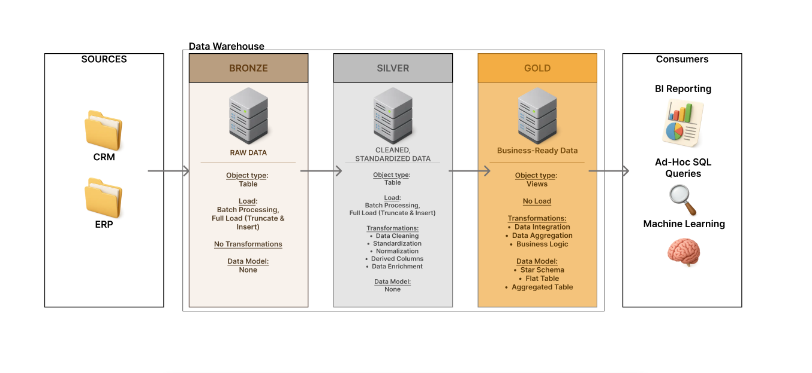
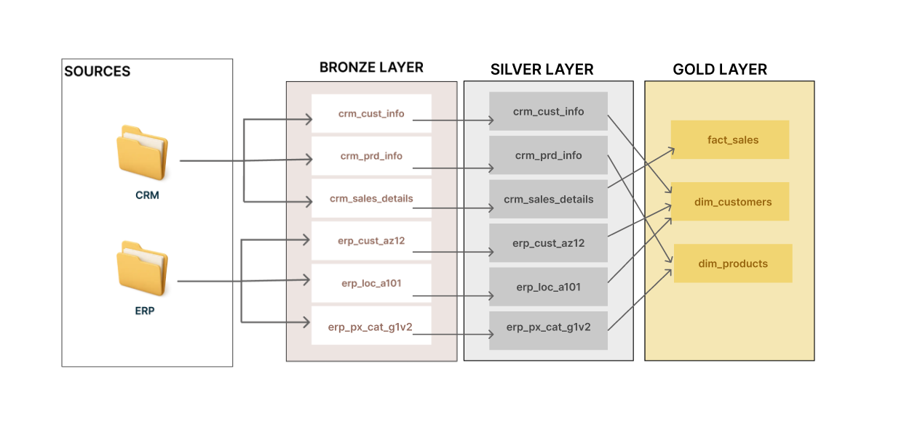
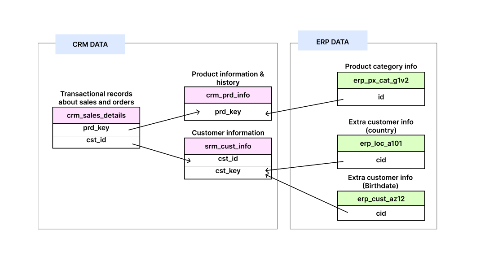
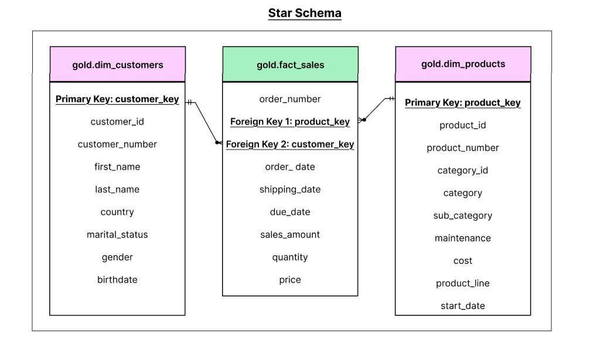

<h1>
  
  SQL Data Warehouse with Medallion Architecture
</h1>

 <h2> 
 
Overview
 </h2>

This project demonstrates an end-to-end **ETL pipeline** built using the **Medallion Architecture** within **Microsoft SQL Server** and **SQL Server Management Studio (SSMS)**. The solution transforms raw CRM and ERP datasets (in CSV format) into a clean, analytical **data warehouse** optimized for analytics.

---

<h2> 
  
  Architecture </h2>

The warehouse adheres to the **Medallion Architecture** pattern, which categorizes data into Bronze, Silver, and Gold layers. Each layer represents a distinct stage of data processing and transformation.

- **Bronze Layer**: Raw staging layer for batch ingestion.
- **Silver Layer**: Cleansed and standardized data.
- **Gold Layer**: Business-ready, denormalized views modeled using a **star schema**.

---
<h2> 
  
  Data Ingestion </h2>

<h3> 
  
  Source Systems</h3> 

Data is ingested from two structured source systems:

- **CRM (Customer Relationship Management)**
- **ERP (Enterprise Resource Planning)**

Each source contributes 3 CSV files (6 files total) as part of the ETL process:

**CRM Files**
- `cust_info.csv`
- `prd_info.csv`
- `sales_details.csv`

**ERP Files**
- `cust_az12.csv`
- `loc_a101.csv`
- `px_cat_g1v2.csv`

---

<h2>  
  
  ETL Data Pipeline (Bronze → Silver → Gold) </h2>

The flow of data through the warehouse is shown below:

<h3>
  
  Bronze Layer (Staging) </h3>
  
- **Object Type**: Tables  
- **Purpose**: Ingest raw CSVs using batch processing  
- **ETL Action**: `TRUNCATE + BULK INSERT`  
- **Transformations**: None  

<h3>
  
  Silver Layer (Refined) </h3>
  
- **Object Type**: Tables  
- **Purpose**: Apply transformations and prepare for analytics  
- **ETL Action**: `TRUNCATE + INSERT`  
- **Transformations**:  
  - Data cleaning (nulls, invalid dates)
  - Standardization (e.g., gender, country codes)
  - Derived columns (e.g., `cat_id`)
  - Enrichment via joins across CRM and ERP

<h3>
  
  Gold Layer (Semantic) </h3>
  
- **Object Type**: Views  
- **Purpose**: Business-facing model for analytics  
- **ETL Action**: Logical views, no data duplication  
- **Transformations**:  
  - Data integration across domains  
  - Business logic and aggregation  
  - Star schema modeling

---

<h2> 
  
  Silver Layer: Data Cleaning & Integration </h2>

This layer performs core **data wrangling** tasks to convert raw datasets into structured forms. It includes deduplication, type casting, null handling, and value mapping.

⁕ Key Tasks:
- Normalize `gender`, `marital_status`, `country`
- Validate `birthdates`, `sales calculations`
- Generate surrogate and category keys
- Ensure referential integrity between domains

---

<h2>
  
  Gold Layer: Star Schema </h2>

The Gold layer presents data in a **denormalized** format designed for **OLAP**, **dashboards**, and **machine learning pipelines**.

### 🔹 Dimension Tables:
- `gold.dim_customers`: Combines customer + demographic + location info  
- `gold.dim_products`: Combines product + category + pricing info  

### 🔸 Fact Table:
- `gold.fact_sales`: Transactional sales fact with foreign key references  

---

## 📊 Use Cases Enabled

The warehouse supports the following downstream use cases:

-  **Business Intelligence Dashboards** 
-  **Ad-Hoc SQL Analytics**
-  **Machine Learning Models** 
-  **Data Exploration for Analysts & Scientists**

---

## 🛠️ Tech Stack

| Component        | Tool / Technology                      |
|------------------|----------------------------------------|
| RDBMS            | Microsoft SQL Server                   |
| IDE              | SQL Server Management Studio (SSMS)    |
| Language         | T-SQL (Stored Procedures, Views, DDL)  |
| Ingestion Format | CSV (local files)                      |
| Architecture     | Medallion (Bronze → Silver → Gold)     |

---

## Execution Order

1. Run DDL scripts to create Bronze, Silver, and Gold schemas
2. Execute: `EXEC bronze.load_bronze;`
3. Execute: `EXEC silver.load_silver;`
4. Run Gold layer view scripts
